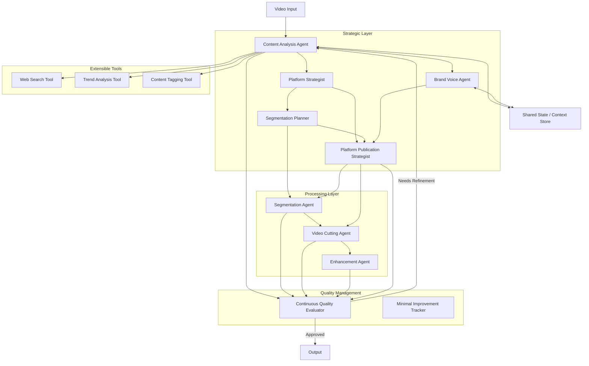

# Viral Clips Crew - Architecture

This document outlines the architecture for the refactored Viral Clips Crew platform.

## Architecture Overview

The new architecture follows a modular, agent-based approach to create a flexible and extensible system for video content processing.

## Core Components

### 1. Shared State / Context Store

The Shared State serves as a central knowledge repository that enables communication between agents and maintains contextual information throughout the workflow.

- **Implementation**: `SharedState` class in `utils.py`
- **Features**:
  - Thread-safe state management
  - Event-based subscription system
  - Persistent storage of workflow state

### 2. Strategic Layer Agents

#### 2.1 Content Analysis Agent

The Content Analysis Agent analyzes video content to extract core insights and identify potential viral segments.

- **Implementation**: `ContentAnalysisAgent` class in `workflow.py`
- **Responsibilities**:
  - Video content comprehension
  - Identify key topics and themes
  - Generate initial metadata
  - Identify potential segment points

#### 2.2 Brand Voice Agent

The Brand Voice Agent maintains consistent brand identity and defines the communication style.

- **Implementation**: `BrandVoiceAgent` class in `workflow.py`
- **Responsibilities**:
  - Create brand voice guidelines
  - Ensure content aligns with brand personality
  - Provide stylistic recommendations

#### 2.3 Platform Strategist

The Platform Strategist analyzes platform-specific requirements and guides content adaptation.

- **Implementation**: `PlatformStrategist` class in `workflow.py`
- **Responsibilities**:
  - Define platform-specific content preferences
  - Provide insights for different distribution channels

#### 2.4 Segmentation Planner

The Segmentation Planner develops an intelligent strategy for breaking down video content.

- **Implementation**: `SegmentationPlanner` class in `workflow.py`
- **Responsibilities**:
  - Analyze content structure
  - Identify natural break points
  - Recommend segmentation approach

#### 2.5 Platform Publication Strategist

The Platform Publication Strategist optimizes content for different distribution channels.

- **Implementation**: `PlatformPublicationStrategist` class in `workflow.py`
- **Responsibilities**:
  - Create platform-specific content strategies
  - Guide post-production content creation
  - Ensure content meets platform requirements

### 3. Processing Layer Agents

#### 3.1 Segmentation Agent

The Segmentation Agent translates the segmentation plan into actionable steps.

- **Implementation**: `SegmentationAgent` class in `workflow.py`
- **Responsibilities**:
  - Implement segmentation guidelines
  - Identify precise segment boundaries
  - Prepare metadata for cutting process

#### 3.2 Video Cutting Agent

The Video Cutting Agent performs the actual video segmentation.

- **Implementation**: `VideoCuttingAgent` class in `workflow.py`
- **Responsibilities**:
  - Execute precise video cuts
  - Maintain video quality
  - Generate segment metadata

#### 3.3 Enhancement Agent

The Enhancement Agent improves video technical quality.

- **Implementation**: `EnhancementAgent` class in `workflow.py`
- **Responsibilities**:
  - Apply technical enhancements
  - Stabilize video
  - Improve audio quality
  - Create platform-specific versions

### 4. Quality Management

#### 4.1 Continuous Quality Evaluator

The Continuous Quality Evaluator ensures content meets predefined quality standards.

- **Implementation**: `ContinuousQualityEvaluator` class in `workflow.py`
- **Responsibilities**:
  - Evaluate content at each workflow stage
  - Identify potential improvements
  - Trigger refinement loops

#### 4.2 Minimal Improvement Tracker

The Minimal Improvement Tracker monitors incremental content improvements.

- **Implementation**: `MinimalImprovementTracker` class in `workflow.py`
- **Responsibilities**:
  - Track changes and their impacts
  - Provide improvement history
  - Support decision-making in refinement process

### 5. Extensible Tools

#### 5.1 Web Search Tool

The Web Search Tool provides access to relevant online information.

- **Implementation**: `WebSearchTool` class in `tools/web_search.py`
- **Capabilities**:
  - Search for trends related to video content
  - Find relevant statistics and research
  - Identify similar successful content

#### 5.2 Trend Analysis Tool

The Trend Analysis Tool examines current trending topics, formats, and styles.

- **Implementation**: `TrendAnalysisTool` class in `tools/trend_analysis.py`
- **Capabilities**:
  - Identify trending hashtags and topics
  - Analyze engagement patterns
  - Evaluate content formats that are performing well

#### 5.3 Content Tagging Tool

The Content Tagging Tool categorizes and tags content for better organization.

- **Implementation**: `ContentTaggingTool` class in `tools/content_tagging.py`
- **Capabilities**:
  - Generate relevant hashtags
  - Identify content categories
  - Create metadata for improved discoverability

## Workflow

1. A video is provided as input
2. The Content Analysis Agent extracts insights
3. Brand Voice and Platform Strategy are defined
4. The Segmentation Plan is developed
5. Video segments are created and enhanced
6. Quality is continuously evaluated
7. Content is approved or refined
8. Final output is generated for each platform

## Design Principles

- **Modularity**: Each component has a single responsibility
- **Flexibility**: Components can be reconfigured or extended
- **Continuous Improvement**: Quality evaluation at every stage
- **Brand Consistency**: Maintaining consistent voice across outputs
- **Platform Optimization**: Content tailored for each distribution channel